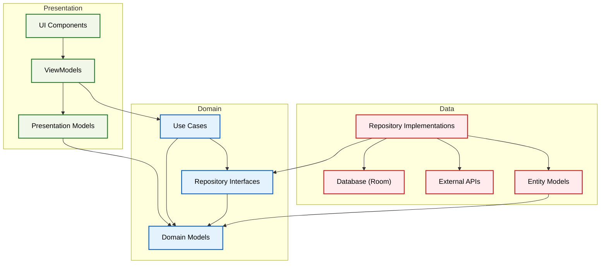
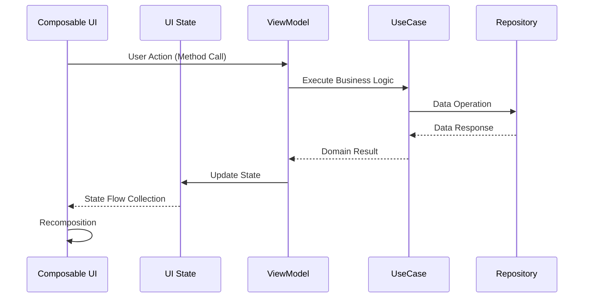
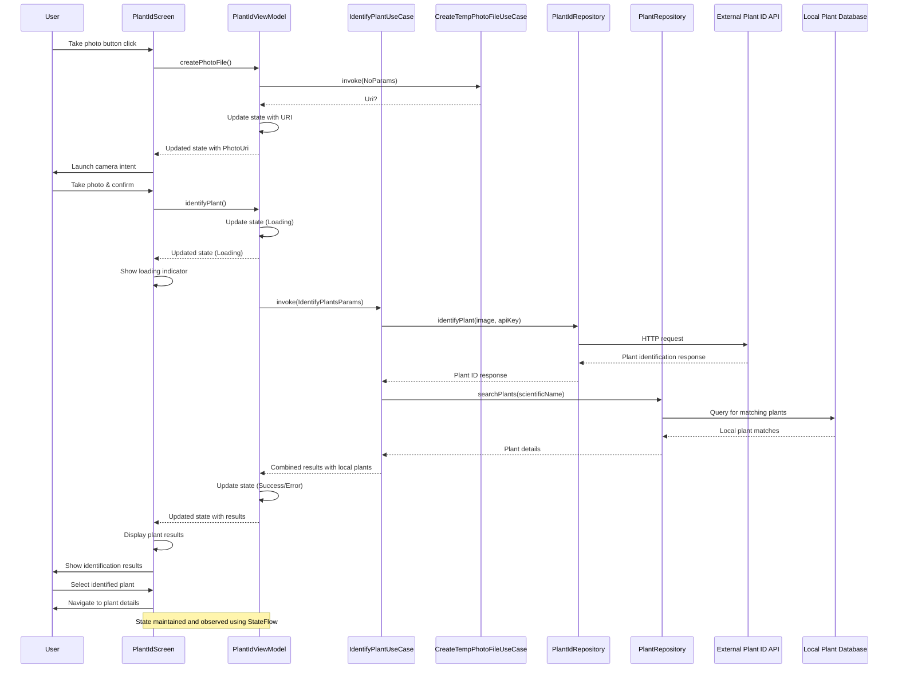

# Planty
*Planty transforms your garden dreams into reality!*

##### Video:

## Overview
### Big picture

#### Key points
1. **Clean Architecture** with clear separation across presentation, domain, and data layers, ensuring a unidirectional dependency flow.

2. **MVVM Pattern** in the presentation layer, using ViewModels to manage UI state and business logic, keeping Composables focused on rendering.

3. **State-Based UI** with immutable state objects flowing from ViewModels to Composables, triggering automatic recomposition when state changes.

4. **Use Case Pattern** isolating specific business operations, making business logic reusable and easily testable.

5. **Repository Pattern** abstracting data sources behind interfaces, allowing the domain layer to remain independent of data implementation details.

6. **Reactive Programming** with Kotlin Flow for asynchronous data streams, state management, and UI updates.

7. **Modular Feature Design** organizing code by features (Garden, Tasks, Plant ID, Catalog) rather than layers, improving maintainability.

8. **Navigation Component** implementing nested navigation graphs for each main feature accessed through bottom navigation.

9. **Dependency Injection** with Hilt throughout the app, facilitating testing and decoupling component creation from usage.

10. **Jetpack Compose UI** using a declarative approach with reusable composables that respond to state changes, creating a responsive and modern UI.

### Component interactions
#### General flow

#### Detailed flow for 'Plant Id' feature

